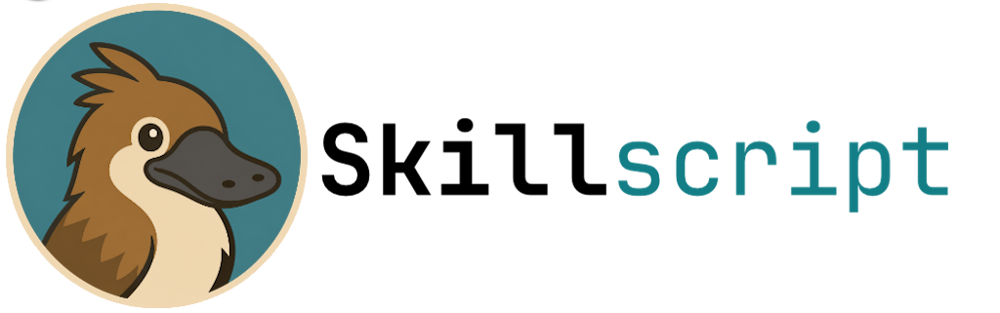

<p align="center">
  
</p>

<p align="center">
<em>Safe, reusable automation authored by agents.</em>
</p>

<p align="center">
  <a href="https://skillscript.ai">skillscript.ai</a>&nbsp; • &nbsp;
  <a href="https://docs.skillscript.ai/docs">docs</a>&nbsp;
  </p>


[](https://www.npmjs.com/package/skillscript-runtime)
[](LICENSE)
[](#status)

> **TL;DR** — `npm install -g skillscript-runtime && skillfile init && skillfile dashboard`. See [Quickstart](#quickstart).

### What is Skillscript?

Skillscript came from asking: what would a Makefile look like if it built skills instead of binaries? The answer is a constrained language, inspired by Make, and a runtime that turns an agent's reasoning into persistent, inspectable automation. The agent writes the skill, you approve what it can do, and it runs the same way every time.

It is built for teams that want agents to create and run recurring workflows without giving them unrestricted shell access, arbitrary package installation, or direct control of production credentials.

An agent writes a skill. A human reviews and approves it. The runtime executes it through configured connectors, allowlists, and security policies.

```bash
npm install -g skillscript-runtime
skillfile init
skillfile dashboard
```

Then connect your agent to the MCP: `http://localhost:7878/rpc` and ask it to author a skill.

## Why use it?

Agents usually re-derive routine tasks from scratch. That increases cost, latency, and behavioral drift.

Skillscript lets an agent crystallize a learned procedure into a named, reusable artifact that can be:

* executed repeatedly without re-planning the entire task
* inspected and versioned by humans
* validated before it is admitted
* limited to approved tools, files, commands, and credentials
* composed with other skills

Skillscript is orchestration-only. Computation stays inside tools and connectors; skills coordinate those capabilities through a small declarative grammar. This can meaningfully cut frontier-model token usage in recurring workflows: the reasoning cost is paid once when the skill is authored, and each run after that executes deterministically, with routine sub-tasks handed to cheaper local models.

## Why not Python or Bash?

Python and Bash remain useful for implementation work. The risk is allowing agent-authored scripts to run unattended with unrestricted access to the host.

Skillscript narrows that execution surface:

* no arbitrary imports, package installation, `eval`, or subprocess escape
* connector-mediated access to external systems
* default-deny shell and filesystem allowlists
* static validation before execution
* optional operator signatures for effectful skills
* credentials held by the runtime rather than embedded in the skill

The goal is not to replace scripts. It is to place scripts and APIs behind capabilities the operator explicitly exposes.

There is also a scaling reason. Reviewing arbitrary code means auditing everything it could do, which takes a skilled reader. A skillscript puts its full effect surface on the page, so approval stays tractable even when agents author faster than anyone can read code, and the operator who knows what their systems should allow can approve on the declared effects rather than by re-reading logic.

## A skill

A skill is a typed, declarative workflow with variables, operations, dependencies, and an output template.

```text
# Skill: hello
# Status: Approved
# Description: Greet someone by name.
# Vars: WHO=world

Hello, ${WHO}!
```

That is a complete, runnable skill. The body is rendered as its output.

Skills can also call connectors, branch, loop, run other skills, respond to events, and execute on schedules:

```text
# Skill: daily-disk-check
# Status: Approved
# Triggers: cron:"0 6 * * *"
# Autonomous: true

Snapshot written for ${NOW}.

snapshot:
    shell(command="df -h --output=source,pcent,target") -> USAGE
    file_write(
        path="/var/log/skillscript/disk-${EVENT.fired_at_unix}.txt",
        content="${USAGE}"
    )

default: snapshot
```

The runtime will refuse the shell command and file write until the operator allowlists the binary and path.

## How it works

1. **Author:** An MCP-connected agent discovers the available tools, writes a skill, and lints it. In secured mode it arrives as `Draft`, inert until you approve it.
2. **Review:** A human inspects and approves the skill. In secured mode, approval signs the approved content with an operator-held key.
3. **Run:** The skill executes from the CLI, MCP, cron, an HTTP event, or another skill.
4. **Observe:** The runtime records traces, outputs, failures, and blocked operations.

Skills can serve three roles:

| Kind           | Purpose                                                 |
| -------------- | ------------------------------------------------------- |
| **Headless**   | Runs autonomously and sends output to a system or human |
| **Augmenting** | Prepares context for a frontier agent                   |
| **Template**   | Gives an agent a reusable procedure to follow           |

## Quickstart

### 1. Install and start the runtime

```bash
npm install -g skillscript-runtime
skillfile init
skillfile dashboard --host 127.0.0.1 --port 7878
```

Open `http://localhost:7878`.

Use `--host 0.0.0.0` only when another container or machine must reach the runtime, and protect exposed ingress appropriately.

### 2. Add the MCP server to your agent

```json
{
  "mcpServers": {
    "skillscript": {
      "type": "http",
      "url": "http://localhost:7878/rpc"
    }
  }
}
```

### 3. Ask the agent to build a skill

> Author a skill that greets someone by name.

The agent writes the skill through MCP. Approve it in the dashboard or CLI:

```bash
skillfile approve hello
skillfile execute hello
```

## Connectors and security

Skills access external systems through configured connectors rather than direct credentials. Connectors can expose MCP tools, data stores, local models, agent delivery channels, or custom runtime capabilities.

Important operator controls:

| Setting                       | Default           |
| ----------------------------- | ----------------- |
| `SKILLSCRIPT_SHELL_ALLOWLIST` | deny all binaries |
| `SKILLSCRIPT_FS_ALLOWLIST`    | deny all paths    |
| `SKILLSCRIPT_SECURED_MODE`    | off               |
| `SKILLSCRIPT_SECRET_<NAME>`   | unset             |

Secrets are resolved by the runtime and passed only to approved sinks. Skills cannot print or inspect their raw values.

See the [configuration guide](docs/configuration.md) and [connector reference](docs/connector-contract-reference.md).

## Common commands

```bash
skillfile lint <skill>
skillfile compile <skill>
skillfile execute <skill>
skillfile approve <skill>
skillfile diagram <skill>
skillfile fires <skill>
skillfile replay <trace_id>
skillfile health
```

Run `skillfile <command> --help` for options.

## Documentation

* [Language reference](docs/language-reference.md)
* [Configuration](docs/configuration.md)
* [Adopter playbook](docs/adopter-playbook.md)
* [Adopter agent guide](docs/adopter-agent-guide.md)
* [Connector contracts](docs/connector-contract-reference.md)
* [Upgrading](UPGRADING.md)
* [Examples](examples/)
* Additional examples on the [website](https://skillscript.ai/examples.php)

## Status

Skillscript is pre-1.0. The core language and connector contracts are stabilizing; external adoption and distribution work are ongoing.

## Contributing

Bug reports and feature requests are welcome through Issues. Open an Issue before proposing grammar changes so the design can be discussed first.

## License

MIT. See [LICENSE](LICENSE).
